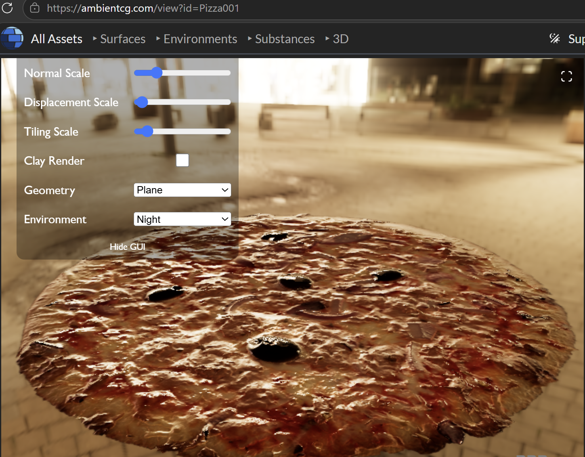
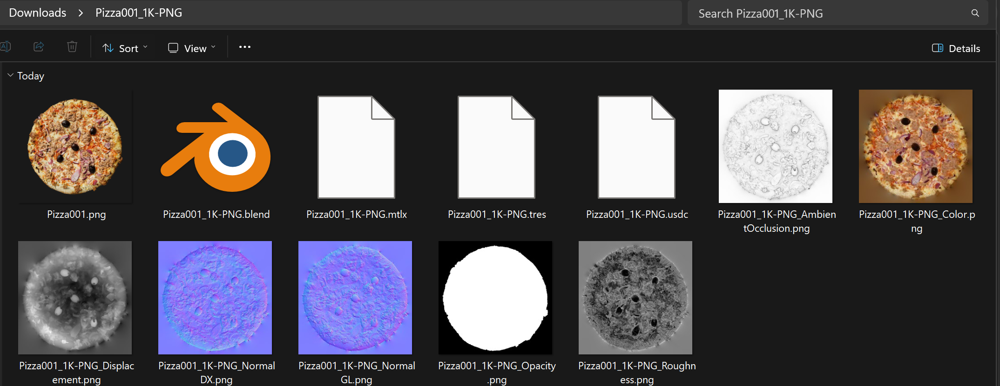
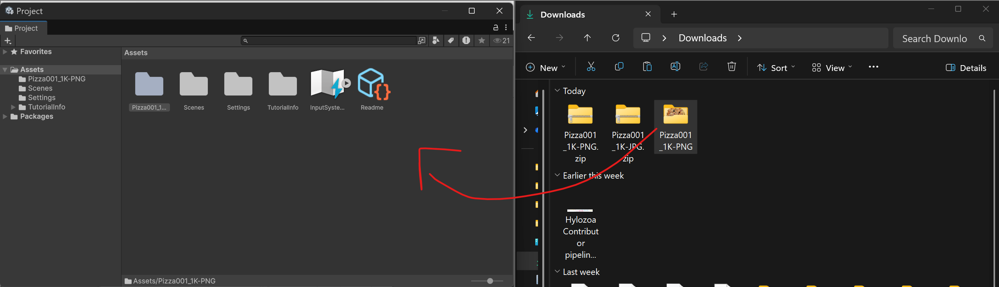
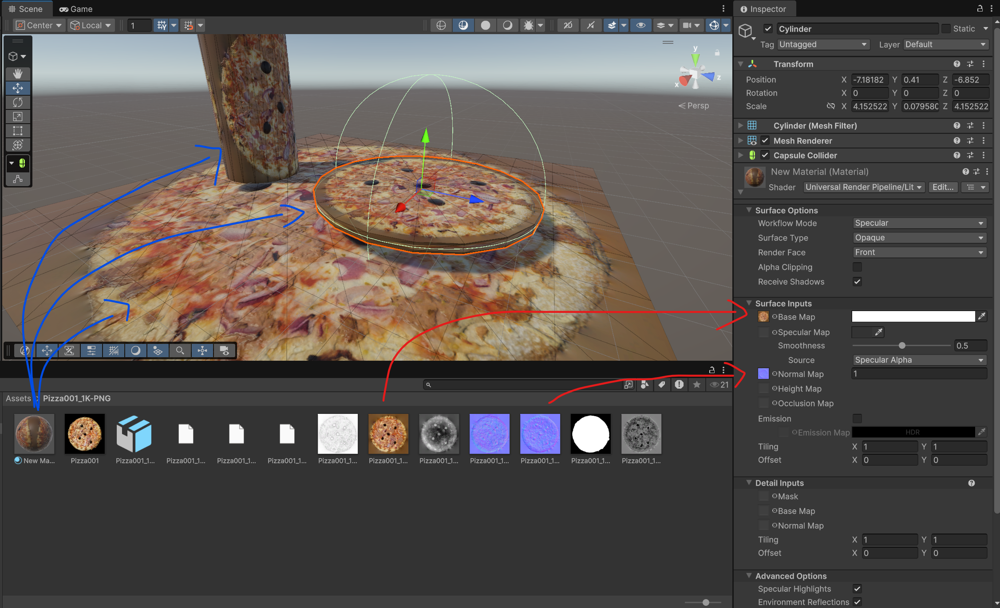
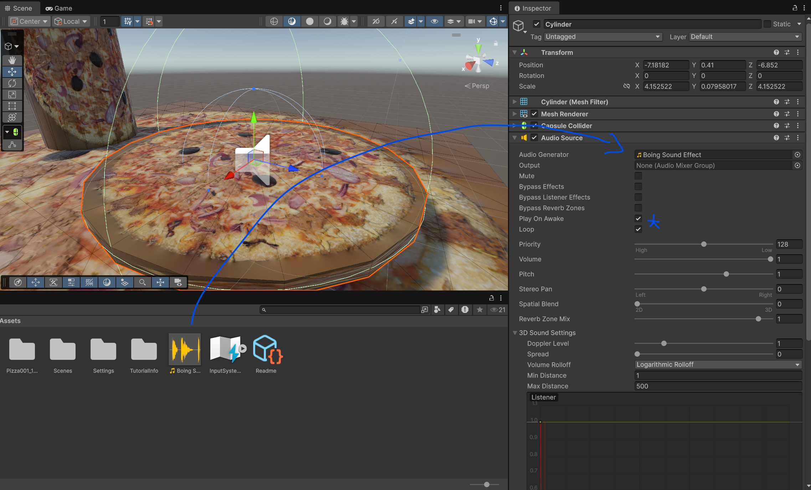
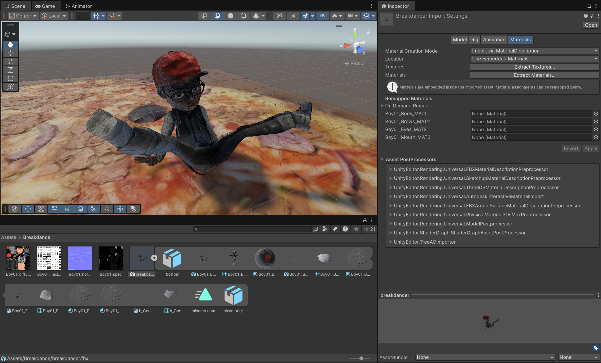
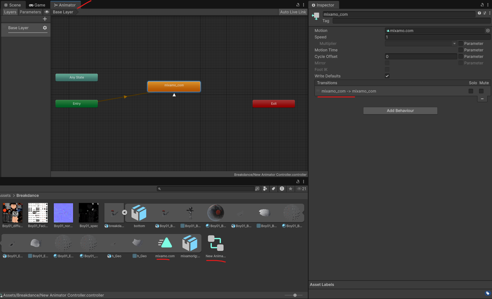
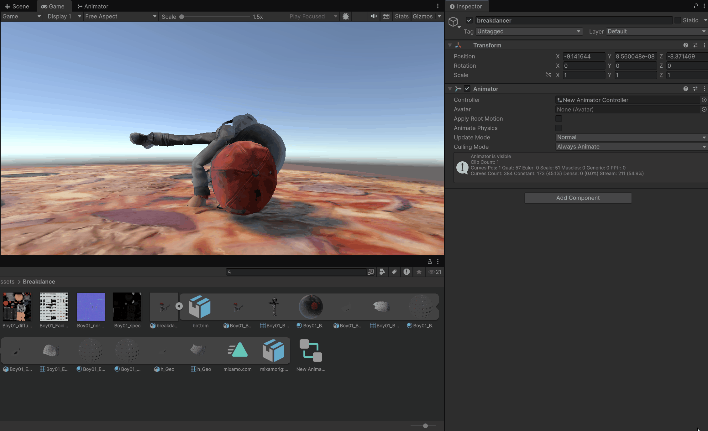
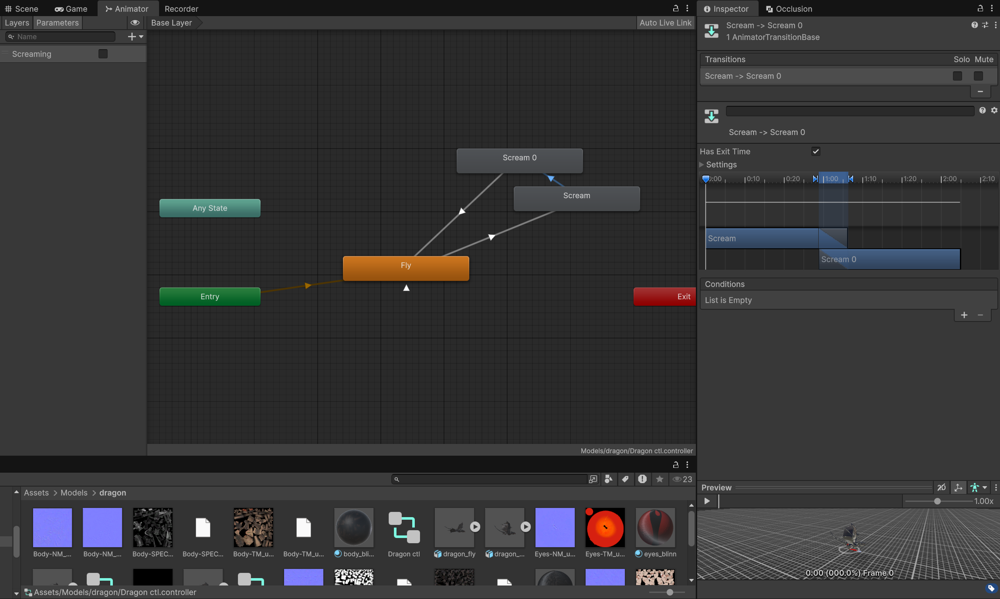
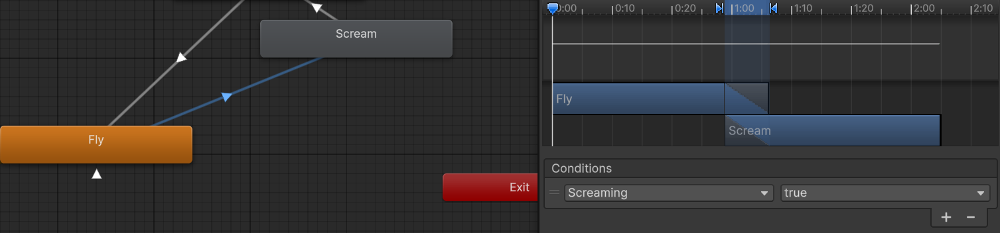

## Assets

You will learn:
- Where to find each asset type and in what format _(for free !)_
- How to import it to your project
- How to convert it to something Unity can use

> [!IMPORTANT]
> The official unity store has a lot of ready to use assets for free or not.  
> Make sure to check it first [here](https://assetstore.unity.com/). Login and get the package you desire.
>
> You can import the packages you bought under the `Window`> `Package Management`>`Package Manager`>`My Assets`
>
> Read below to learn how to use the imported assets.

> [!TIP]
> I have included a [.wav audio file](./Boing%20Sound%20Effect.wav), a [.fbx 3d model](./breakdancer.fbx) and a [.zip texture pack](./Pizza001_1K-PNG.zip) inside the repository.
> I have also included a [unity package](./5-assets.unitypackage) of my scene. Feel free to import it if you want to see the end result.


### Textures

_Preferred format: .png_


###### Can you believe [this](https://ambientcg.com/view?id=Pizza001) is a flat object ? I'll explain how the illusion of depth can be easily made ;)

##### Websites

- https://polyhaven.com/textures
- https://ambientcg.com/
- https://www.materialmaker.org/materials?type=material

More are listed [here](https://gamedevnexus.com/resources/assets/).


#### Tasks

[] Download any texture pack from anywhere



[] Drag and drop the _(unzipped)_ folder from the file explorer into the Project window



[] Inside the texture folder, do `Right Click`>`Create`>`Material`
[] Drag and drop the textures into the material parameters



> [!TIP]
> Only worry about configuring `Workflow Mode`, `Base Map`, `Normal Map` as well as `Tiling` and `Offset`.    
> The others parameters are less useful.

[] Drag the material into the object within the Scene window

> [!CAUTION]
> The material might not be adapted to your game object _(look at the silly cylinder)_. 
> Create a variant of your material. Then, update `Tiling` and `Offset` until it looks good.

-------------
#### Audio

###### _Preferred format: .wav_

##### Websites

- https://www.youtube.com/ -> any youtube to wav website _(be careful of weird popups)_
- https://freesound.org/
- https://pixabay.com/sound-effects/search/nature/

#### Tasks

[] Download your audio file
[] Drag and drop it into the Projects window and let Unity import it into an `AudioClip`

> [!CAUTION]
> Some wav encoding might results in import errors.
> Change the encoding using Audacity _(or similar)_ or download from another source.

 

[] Add a `AudioSource` component to your game object
[] Drag the `AudioClip` into the `Audio Generator` parameter
[] Check `Play On Awake` and start the game 

-------------
#### 3d Models

###### _Preferred format: .fbx_

##### Websites

- https://sketchfab.com/feed _(Quality varies and some might not be downloadable)_
- https://polyhaven.com/models
- https://www.mixamo.com/ _(Lots of basic character compatible with all their animations)_
- https://www.cgtrader.com/ _(Some nice character can be downloaded for free)_
- https://www.turbosquid.com/fr/


[] Drag and drop the fbx file into the Projects window to import the model
[] Drag your imported model from the Projects window into the scene

> [!CAUTION]
> Some model might have a camera associated with it.    
> You should delete it.

> [!CAUTION]
> Some materials might appear purple.
> Go to `Window`>`Rendering`>`Render Pipeline Converter`, check all options, `Initialize Converters` then `Convert Assets`.

> [!CAUTION]
> Some materials might be textureless _(white)_
> `Materials`>`Extract Texture` might fix it.
> If not, `Materials`>`Extract Materials` and place the textures into the materials again.



##### Play Animations

[] Download a model with an animation. You can verify by looking at the `Animation` tab and see if there are clips present.

[] `Right Click`>`Create`>`Animation`>`Animator Controller`
[] Open the `Window`>`Animation`>`Animator` window and select the newly created `Animator Controller` 
[] Drag and drop the `Animation Clip` into it
[] `Right click` on it > `Make Transition` into itself (to loop).



[] Select your model's game object
[] Add a `Animator` component to it
[] Drag and drop the `Animator Controller` object into the `Controller` parameter



> [!TIP]
> 
> Here is a 2 animation controller example from my 3D animation class project.
> You can configure the transition to be smoother.

> [!TIP]
> 
> You can define conditions for transitioning from an animation to another. 
> The parameters associated with the animator can be found on the top left corner of the window.
> Here is a snippet of a script I used to change the `triggerName` state after `delay` seconds:
> ```c# 
> public float delay = 3.0f;
> public string triggerName;
> void Update()
>     {
>         timeBuffer += Time.deltaTime;
>         if (timeBuffer >= delay)
>         {
>             GetComponent<Animator>().SetBool(triggerName, true);
>             timeBuffer = 0.0f;
>         }
>     }
> ```


-----
You can now look for, import and make use of any assets you want !
**The possibilities are now limitless !**

[KEEP MASTERING UNITY](./../README.md#Concepts)